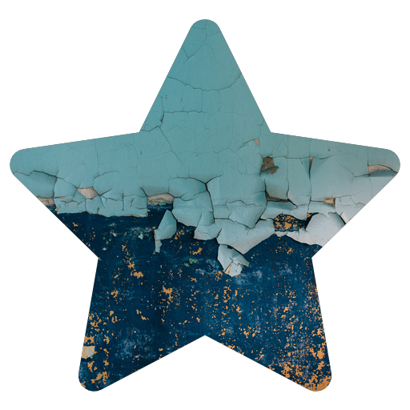

## Usage
> Works best with landscape photos.

```
./cookie-cutter.sh mask.png image.jpg result.png [resultWidth (optional)] [resultHeight (optional)] [resultBackgroundColor (optional)]
```

> The script will find the image's average color and apply that to the background if no background color is supplied. If no width, height, or color is passed, the result with have a transparent background and the same dimensions as the mask.

You can loop through a directory of images with something like the following:
```
for file in *; do TIME=$(date +%s) && ~/cookie-cutter/cookie-cutter.sh ~/cookie-cutter/example/star.png "$file" ~/Wallpaper/$TIME.png 2880 1800; done
```

## Example
> See the [example directory](https://github.com/jessemillar/cookie-cutter/tree/master/example) for examples of valid files.

```
./cookie-cutter.sh example/star.png example/background.jpg example/icon.png
```


```
./cookie-cutter.sh example/star.png example/background.jpg example/avatar.png 700 700
```

